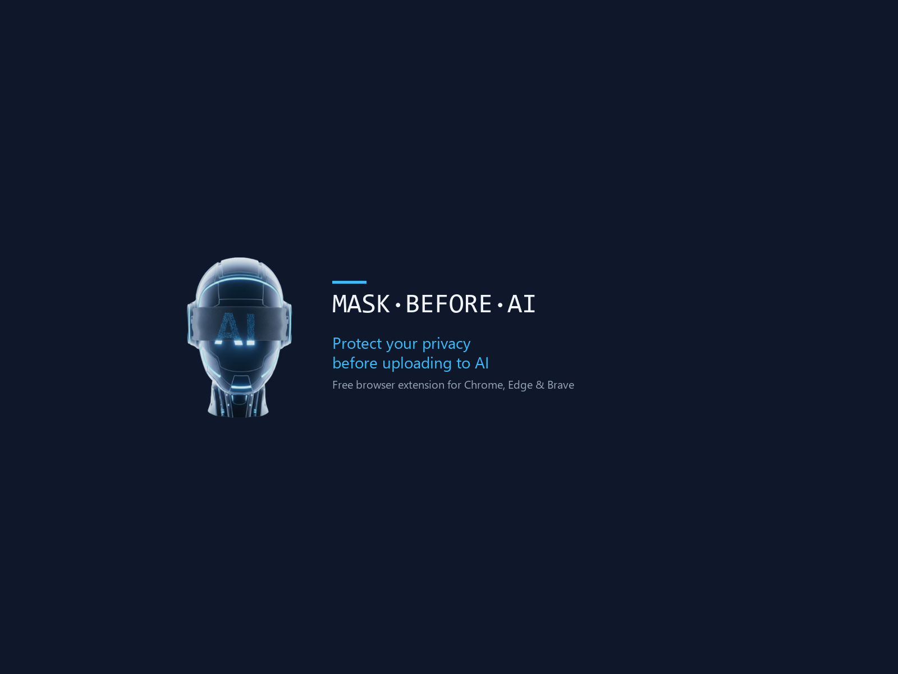

  

  
  
  

---

## Why?

Every day, millions of people paste screenshots and documents into AI chatbots — ChatGPT, Claude, Gemini, Copilot, and others. Those files often contain **sensitive information**: email addresses, phone numbers, passwords, personal names, home addresses, and more. Once uploaded, you lose control over that data.

**MaskBeforeAI** is a browser extension that intercepts file uploads and pastes on AI platforms, gives you a chance to review and mask sensitive areas, then lets the safe file continue. Everything runs **locally in your browser** — no data leaves your device.

---

## How It Works

1. **Intercept** — The extension detects when you upload or paste a file on a supported AI platform
2. **Review** — An interactive dialog opens where you can draw masking boxes, use a brush tool, or use an eraser
3. **Redact** — Choose blur, pixelate, or black-box — the masked file replaces the original before upload

### See It in Action

Check out our [product demo video](https://mask.ki-sum.ai/#gallery) on the website.

---

## Supported AI Platforms

| Platform | URL |
|----------|-----|
| ChatGPT | chatgpt.com |
| Claude | claude.ai |
| Microsoft Copilot | copilot.microsoft.com |
| Google Gemini | gemini.google.com |
| Perplexity | perplexity.ai |
| DeepSeek | chat.deepseek.com |
| Grok | grok.com |
| Meta AI | meta.ai |
| Mistral | chat.mistral.ai |

---

## Supported File Types

### Free
- **Images** — PNG, JPG, GIF, WebP, BMP

### Pro
- **PDF** — Multi-page review with page-by-page masking
- **Documents** — DOCX (Word)
- **Code files** — .js, .py, .ts, .java, .cpp, and more
- **Text files** — .txt, .csv, .json, .xml, .yaml

---

## Masking Modes

- **Blur** — Gaussian blur over the selected region. Content becomes unreadable while preserving layout context.
- **Pixelate** — Mosaic/pixelation effect. Obscures details while hinting at structure.
- **Black Box** — Solid black rectangle. The most thorough redaction — nothing is recoverable.

---

## Installation

### Chrome Web Store (recommended)

> Coming soon — the extension is currently under review.

### Supported Browsers

Any Chromium-based browser: Chrome, Edge, Brave, Arc, Vivaldi, Opera.

---

## Pricing

| Plan | Price | What's included |
|------|-------|-----------------|
| **Free** | €0 | Image masking on all 9 AI platforms |
| **Pro Monthly** | €7.99/month | Image, PDF, DOCX, code & text file masking, multi-page review, PDF export |
| **Pro Annual** | €19.99/year | Same as Pro Monthly — save 79% |
| **Enterprise** | Contact us | AI-powered face detection, NER, OCR, desktop app |

---

## Enterprise Features

The following features are available in **MaskBeforeAI Enterprise**:

| Feature | Description |
|---------|-------------|
| Face Detection | AI-powered automatic face detection and blur |
| NER Recognition | Named Entity Recognition for names, addresses, organizations |
| OCR Auto-Detection | High-speed text detection and PII pattern matching |
| Desktop App | System-wide clipboard monitoring with desktop application |
| Policy Signing | HMAC-SHA256 strategy signing and audit logging |

---

## Feedback & Bug Reports

Found a bug or have a feature request?

- **GitHub Issues**: [Open an issue](https://github.com/kisumgmbh/mask-before-ai/issues)
- **Email**: [info@ki-sum.ai](mailto:info@ki-sum.ai)
- **Website**: [mask.ki-sum.ai](https://mask.ki-sum.ai)

---

## About

MaskBeforeAI is developed by **[Kisum GmbH](https://kisum-gmbh.com)**, based in Munich, Germany.

## License

[Apache License 2.0](LICENSE) — Copyright 2026 Kisum GmbH
